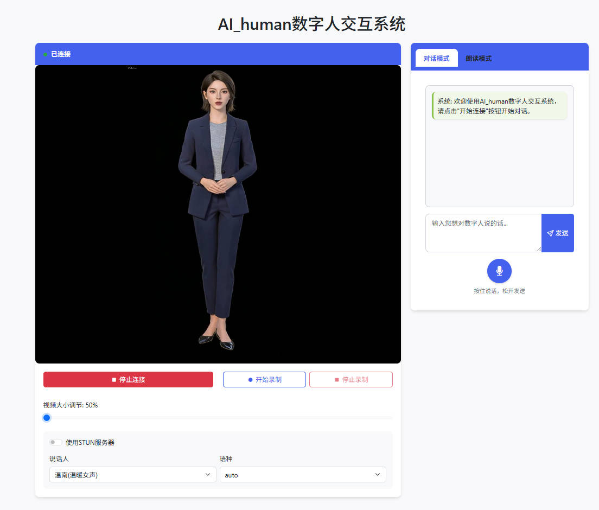

# AI Human · 实时数字人交互系统

> 个人学习与工程实践仓库：**[@xyounghe](https://github.com/xyounghe)**  
> 联系：**hexiaoyang1224@163.com**

本项目是一套面向 **实时音视频对话的数字人（Talking Head）** 方案：将语音合成、口型驱动与 WebRTC 推流串联起来，可在浏览器中低延迟预览虚拟形象。代码在 [LiveTalking](https://github.com/lipku/LiveTalking) 开源框架基础上扩展与整合，并接入了 **通义千问 Qwen** 相关 TTS/ASR 能力与多种 LLM 适配脚本，便于按场景替换模块。

---


<!-- GitHub README 不支持 <video> 内嵌播放；演示文件需已 git 提交（勿被 *.mp4 忽略） -->

<p align="center">
  
</p>

<p align="center">
  <b>演示视频</b>（在仓库页面点击即可在线播放或下载；若无法播放，请用 Raw 链接在浏览器打开）<br/>
  <a href="./assets/2.mp4">▶ 演示 1</a>
  &nbsp;·&nbsp;
  <a href="./assets/3.mp4">▶ 演示 2</a>
</p>

> **说明**：本地用 VS Code / Cursor 预览 Markdown 时，`<video>` 有时能播，但 **GitHub 会去掉视频标签**，所以这里改成 **图片 + 视频文件链接**。推送后若仍打不开视频，请确认已执行 `git add assets/*.mp4`（本仓库 `.gitignore` 已对 `assets/` 下的 mp4 做了例外放行）。

---


## 作者与仓库说明

| 项 | 内容 |
|----|------|
| **维护者** | [xyounghe](https://github.com/xyounghe) |
| **邮箱** | [hexiaoyang1224@163.com](mailto:hexiaoyang1224@163.com) |
| **许可** | 以仓库内 [`LICENSE`](LICENSE) 为准（上游组件多为 Apache-2.0 等，使用时请一并遵守各模型与依赖的授权条款） |

若在 GitHub 上看到本仓库，默认 **作者与主要联系人** 为上述信息；欢迎通过 Issue 或邮件交流。

---

## 功能概览

- **口型 / 形象驱动**：集成 **MuseTalk**、**Wav2Lip**、**Ultralight** 等路径（见源码中的 `musereal.py`、`lipreal.py`、`lightreal.py` 等）。
- **语音合成（TTS）**：支持 Edge TTS、Azure Speech、GPT-SoVITS 服务调用，以及 **Qwen TTS**（本地模型路径可配置，见下方运行示例）。
- **语音识别（ASR）**：包含 **Qwen3 ASR** 相关代码（`qwen_asr/` 与 `Qwen/Qwen3-ASR-1.7B` 等资源目录）。
- **对话与编排**：多份 LLM 适配脚本（`llm.py`、`llm1.py` …）便于对接不同 API。
- **实时传输**：基于 **WebRTC**（`webrtc.py`）与 Web 端页面（`web/`）。

---

## 技术栈（摘要）

Python · PyTorch · OpenCV · aiortc · Flask · Transformers / Diffusers · 自研与上游 MuseTalk、Wav2Lip 模块

---

## 目录结构（部分）

```
AI_human/
├── web/                 # 前端页面与脚本（如 dashboard、WebRTC 相关 JS）
├── musetalk/            # MuseTalk 推理与工具
├── wav2lip/             # Wav2Lip 与形象生成脚本
├── ultralight/          # Ultralight 相关
├── qwen_asr/            # Qwen3 ASR 封装与 CLI
├── Qwen/                # Qwen TTS / ASR 模型与配置（体积大，按需下载或放置）
├── data/                # 头像、自定义音视频等（默认可能被 .gitignore 忽略，部署时请自备）
├── models/              # 运行时模型权重目录（通常不提交仓库）
├── requirements.txt     # Python 依赖
├── Dockerfile           # 参考容器环境（CUDA / Conda 等）
└── caozuo.txt           # 本地常用启动命令备忘
```

---

## 环境要求

- **OS**：Linux（推荐，Dockerfile 面向 Linux CUDA）或 Windows（需自行解决 CUDA / 依赖差异）。
- **Python**：建议 **3.10**（与常见 PyTorch 生态一致；以你本机验证为准）。
- **硬件**：口型模型与 TTS 推理建议 **NVIDIA GPU**；部分路径支持 CPU / MPS，但实时体验会下降。
- **系统依赖**：**FFmpeg**（音视频处理）、可用麦克风/扬声器（若走全双工对话）。

---

## 安装

```bash
# 建议使用虚拟环境
python -m venv .venv
# Windows: .venv\Scripts\activate
# Linux/macOS: source .venv/bin/activate

pip install -r requirements.txt
```

> **模型与数据**：详见下一节；本仓库 `.gitignore` 默认忽略 `data/`、`models/` 等大目录，推送 GitHub 前请确认勿提交隐私或超大文件。

---

## 模型与数据下载（路径一览）

所有 **本地相对路径** 均以项目根目录 `AI_human/` 为准（即与 `README.md` 同级）。若访问 Hugging Face 较慢，可在运行前设置镜像（与 [LiveTalking 文档](https://github.com/lipku/LiveTalking) 一致）：

```bash
# Linux / macOS
export HF_ENDPOINT=https://hf-mirror.com
```

Windows（PowerShell）示例：`$env:HF_ENDPOINT="https://hf-mirror.com"`

### 总目录约定

| 目录 | 用途 |
|------|------|
| **`models/`** | Wav2Lip / MuseTalk / Whisper / VAE / 本地 LLM 等权重（`.gitignore` 通常不提交） |
| **`data/avatars/<avatar_id>/`** | 数字人形象数据（帧图、`coords.pkl`、`latents.pt` 等，由生成脚本或上游压缩包解压得到） |
| **`Qwen/`**（可选） | 已将 Qwen TTS、ASR 放在仓库旁时，启动参数可直接写 `Qwen/Qwen3-...` 等相对路径 |

---

### 1. Wav2Lip（`--model wav2lip`）

| 文件 / 目录 | 放置路径 | 下载说明 |
|-------------|----------|----------|
| Wav2Lip 权重 | **`models/wav2lip.pth`** | 上游 [LiveTalking README](https://github.com/lipku/LiveTalking) 提供 **夸克网盘 / Google Drive**：下载 `wav2lip256.pth` 后放到 `models/`，并**重命名为** `wav2lip.pth` |
| 预制形象 | **`data/avatars/<例如 wav2lip256_avatar1>/`** | 下载 `wav2lip256_avatar*.tar.gz`，解压后**整个文件夹**拷到 `data/avatars/` 下 |

自定义形象：见下文「形象数据」或 `caozuo.txt` 中 `wav2lip/genavatar.py` 示例。

---

### 2. MuseTalk（`--model musetalk`）

代码默认从 `musetalk/utils/utils.py` 读取：

| 文件 / 目录 | 放置路径 | 下载说明 |
|-------------|----------|----------|
| UNet 与配置 | **`models/musetalkV15/unet.pth`**、**`models/musetalkV15/musetalk.json`** | 可从 Hugging Face 仓库下载同名目录，例如 [TMElyralab/MuseTalk](https://huggingface.co/TMElyralab/MuseTalk/tree/main) 或 [Non-playing-Character/Musetalk_models](https://huggingface.co/Non-playing-Character/Musetalk_models/tree/main) 中的 **`musetalkV15/`**，保持与上游目录结构一致后合并到本地 **`models/musetalkV15/`** |
| SD VAE（Diffusers 格式） | **`models/sd-vae/`** | 与 `VAE(model_path=...)` 一致，需为 `from_pretrained` 可用的目录。可从 [**stabilityai/sd-vae-ft-mse**](https://huggingface.co/stabilityai/sd-vae-ft-mse) 拉取全量文件到该路径（若你本地文件夹名不同，需与代码中 `vae_type` / 路径一致） |
| Whisper 特征提取 | **`models/whisper/`** | `musereal.py` 中 **`Audio2Feature(model_path="./models/whisper")`**，需为 Transformers 可用的 Whisper 目录。推荐用官方工具整库下载到该路径，例如：<br>`huggingface-cli download openai/whisper-tiny --local-dir ./models/whisper` |

---

### 3. Ultralight（`--model ultralight`）

| 文件 | 放置路径 | 说明 |
|------|----------|------|
| 形象专用权重 | **`data/avatars/<avatar_id>/ultralight.pth`** | `lightreal.py` 从当前形象目录加载；需先用 `ultralight/genavatar.py` 等流程生成形象并指定 `--checkpoint`（会将权重复制到形象目录） |
| HuBERT 音频特征 | （缓存或在线） | `ultralight/audio2feature.py` 使用 **`facebook/hubert-large-ls960-ft`**，首次运行会从 Hugging Face 自动拉取（需网络或配置 `HF_ENDPOINT`） |

---

### 4. Qwen TTS（`--tts qwentts`）

| 来源 | 本地路径示例 | Hugging Face（可 `from_pretrained`） |
|------|----------------|--------------------------------------|
| 默认可用仓库 ID | 启动参数 `--QWEN_MODEL_PATH` | 默认参考代码内 **`Qwen/Qwen3-TTS-12Hz-0.6B-CustomVoice`**（见 `ttsreal.py`） |
| 本仓库旁目录 | `Qwen/Qwen3-TTS-12Hz-1.7B-CustomVoice` 等 | 与 `caozuo.txt` 示例一致时，可直接指向 **`Qwen/Qwen3-TTS-12Hz-1.7B-CustomVoice`** |

从 Hub 下载示例：

```bash
huggingface-cli download Qwen/Qwen3-TTS-12Hz-1.7B-CustomVoice --local-dir ./Qwen/Qwen3-TTS-12Hz-1.7B-CustomVoice
```

（模型体积较大，请预留磁盘空间。）

---

### 5. Qwen3 ASR（`qwen_asr/`）

适用于 CLI / 服务形态，与 **`Qwen3-ASR-1.7B`** 等配置一致。

| 用途 | Hugging Face 仓库 |
|------|-------------------|
| 语音识别主模型 | [**Qwen/Qwen3-ASR-1.7B**](https://huggingface.co/Qwen/Qwen3-ASR-1.7B) |
| 可选：强制对齐 / 时间戳 | [**Qwen/Qwen3-ForcedAligner-0.6B**](https://huggingface.co/Qwen/Qwen3-ForcedAligner-0.6B) |

本地可放在 `Qwen/Qwen3-ASR-1.7B/`（你已从 Hub 拉取时），运行 demo 时传入**本地目录路径**或 **Hub 上的模型 ID** 均可（见 `qwen_asr/cli/demo.py` 的 `--asr-checkpoint` 说明）。

---

### 6. 本地 LLM（如 `llm1.py`）

| 变量 / 路径 | 说明 |
|-------------|------|
| **`./models/Qwen2.5-1.5B-Instruct`** | `llm1.py` 中写死的本地目录；需自行从 [Qwen2.5 系列](https://huggingface.co/Qwen) 下载完整模型到该路径，或改代码指向你的目录 |

其他 `llm.py`、`llm2.py` 等多为 **云端 API**（如 DashScope），需在环境变量或配置中填写 **API Key**，不依赖 `models/` 下的权重。

---

### 7. 形象数据 `data/avatars/` 里一般有什么

不同管线生成结果不同，常见包括：

- **`full_imgs/`**：全身图序列  
- **`face_imgs/`**（Wav2Lip）  
- **`coords.pkl`**、**`latents.pt`**、**`mask/`** 等（MuseTalk 等）  
- **`avator_info.json`**（形象元数据）

`.gitignore` 中若忽略了整个 **`data/`**，换机后需重新下载或本地生成，勿依赖 Git 同步大文件。

---

### 8. 其他说明

- **上游打包资源**：Wav2Lip 权重与示例形象以 [lipku/LiveTalking](https://github.com/lipku/LiveTalking) 主页 / 文档中的 **网盘链接** 为准（链接会更新，README 不重复抄写）。  
- **版权**：各模型受其官方许可证约束；商用前请阅读 Qwen、Wav2Lip、MuseTalk、Stable Diffusion VAE 等条款。  
- **校验**：大文件建议核对上游提供的校验和；从第三方镜像下载时注意安全。

---

## 运行说明

本地命令备忘见 [`caozuo.txt`](caozuo.txt)。示例如下（与 LiveTalking 系列启动方式一致，参数需与你的头像 ID、模型路径一致）：

```bash
# WebRTC + Wav2Lip 示例
python app.py --transport webrtc --model wav2lip --avatar_id wav2lip256_avatar2

# 搭配 GPT-SoVITS 等外部 TTS 服务（Windows 下可把反斜杠改成 ^ 续行）
python app.py --transport webrtc --model wav2lip --avatar_id wav2lip256_avatar2 \
  --tts gpt-sovits --TTS_SERVER http://127.0.0.1:9880 --REF_FILE ref.wav --REF_TEXT "参考文本"

# 自定义视频/音频配置
python app.py --transport webrtc --model wav2lip --avatar_id wav2lip256_avatar2 \
  --customvideo_config data/custom_config.json

# Qwen TTS 示例
python app.py --tts qwentts --QWEN_MODEL_PATH Qwen/Qwen3-TTS-12Hz-1.7B-CustomVoice --QWEN_ATTN_IMPLEMENTATION sdpa
```

**从视频生成 Wav2Lip 头像（示例）：**

```bash
cd wav2lip
python genavatar.py --video_path your_video.mp4 --img_size 256 --avatar_id wav2lip256_avatar1
```

> **说明**：若你克隆的副本中 **没有** `app.py`，请从上游 [lipku/LiveTalking](https://github.com/lipku/LiveTalking) 对照补齐主入口，或直接使用上游仓库作为基线后再合并本仓库的改动。

---

## 致谢与版权声明

核心实时数字人管线思路与大量基础代码来自 **LiveTalking**（[@lipku](https://github.com/lipku)），感谢原作者开源。本仓库为 **xyounghe** 的学习、整合与二次开发记录；使用时请保留各文件中的版权与许可声明，并遵守 **Apache-2.0** 及所用模型（如 Qwen、Whisper 等）的分发条款。

---

## Star 与引用

如果这个项目对你有帮助，欢迎在 GitHub 上点个 **Star** 或分享给有需要的人——这也是对我继续维护的动力。
